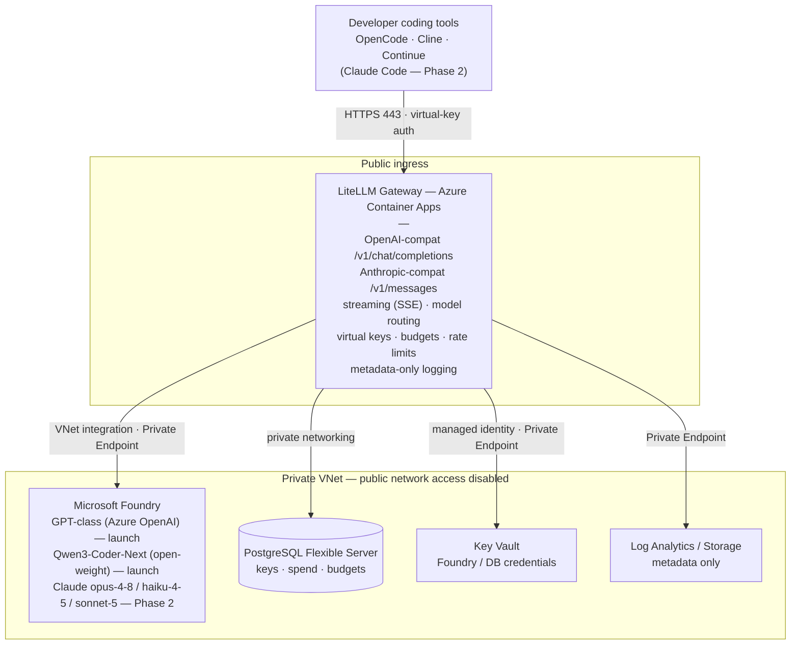

# Technical Design Document — Internal LLM Gateway for Coding Tools

**Status:** Draft v2 (verified against vendor docs 2026-07-10) — **Proof-of-Concept / evaluation stage**
**Owner:** garyljackson@gmail.com
**Last updated:** 2026-07-10
**Companions:** `PRD.md` (product), `EVALUATION.md` (PoC success criteria & go/no-go)

---

## 1. Summary

A self-hosted **LiteLLM** proxy (MIT core) running on **Azure Container Apps** fronts **Microsoft Foundry** model deployments. LiteLLM presents both an OpenAI-compatible and an Anthropic-compatible (`/v1/messages`) API on one endpoint. Only the gateway ingress is public (virtual-key auth); Foundry, PostgreSQL, Key Vault, and logging are private (VNet + private endpoints). Access is gated by Entra ID group membership via provisioning automation; cost/usage are controlled by per-key/per-team budgets in LiteLLM with metadata-only logging. Infrastructure is provisioned with **Bicep**.

**Phasing:** Launch serves **GPT-class (Azure OpenAI) + open-weight** models (standard Azure billing) for OpenAI-format tools. **Claude (Hosted on Azure) + Claude Code are deferred to Phase 2**, which adds the Azure Marketplace/CCU subscription and Claude deployments — additive, no re-architecture (LiteLLM is model-agnostic).

## 2. Verified facts (2026-07-10)

| Claim | Verified outcome |
|-------|------------------|
| Claude on Microsoft Foundry | GA. Two hosting modes: **Hosted on Azure** (runs on Azure end-to-end) and **Hosted on Anthropic infrastructure** (runs outside Azure). |
| Models **Hosted on Azure (GA)** | `claude-opus-4-8`, `claude-sonnet-5`, `claude-haiku-4-5`. These are the ones that satisfy the in-tenant requirement. |
| LiteLLM → Foundry Claude | Provider prefix `azure_ai/`; `api_base` = `https://<resource>.services.ai.azure.com/anthropic` (LiteLLM auto-appends `/v1/messages`). Auth via API key or Entra AD token/service principal. |
| LiteLLM Anthropic + OpenAI endpoints | Serves both `/v1/messages` (Anthropic) and OpenAI-compatible routes; documented Claude Code integration. |
| Claude Code env vars | `ANTHROPIC_BASE_URL`, `ANTHROPIC_AUTH_TOKEN`, `ANTHROPIC_MODEL` confirmed. Fast/background model is **`ANTHROPIC_DEFAULT_HAIKU_MODEL`** (the old `ANTHROPIC_SMALL_FAST_MODEL` is deprecated). |
| LiteLLM license | MIT core, free self-hosted. Enterprise (paid) needed for SSO **beyond 5 users**, audit logs, RBAC, SLA. Our design uses MIT core only. |
| IaC | **Bicep** (chosen). |

## 3. Architecture



## 4. Model catalog & routing

**Governance rule:** use only **Hosted on Azure** Claude deployments so inference stays on Azure. The "Hosted on Anthropic infrastructure" variants run outside Azure and must **not** be used for governed traffic.

**Deployment type:** prefer **Data Zone Standard (US)** for `claude-opus-4-8` and `claude-sonnet-5` where US data residency is desired; otherwise **Global Standard**. Regions offering these: **East US 2** and **Sweden Central**.

LiteLLM maps friendly names to Foundry deployments; clients see only the friendly names (F12).

```yaml
model_list:
  # === LAUNCH (Phase 1): standard Azure billing, no Marketplace/CCU ===
  - model_name: gpt-class
    litellm_params:
      model: azure/<azure-openai-gpt-deployment>     # Azure OpenAI
      api_base: https://<resource>.openai.azure.com
      api_key: os.environ/AZURE_API_KEY

  - model_name: qwen3-coder                # Qwen3-Coder-Next (open-weight, Apache-2.0)
    litellm_params:
      model: azure_ai/<qwen3-coder-next-deployment>
      api_base: https://<resource>.services.ai.azure.com/models
      api_key: os.environ/AZURE_AI_API_KEY

  # === PHASE 2 (deferred): Claude, Hosted on Azure (in-tenant) — enables Claude Code ===
  # Requires Azure Marketplace/CCU subscription before deploying.
  - model_name: claude-opus-4-8            # Claude Code main model
    litellm_params:
      model: azure_ai/claude-opus-4-8
      api_base: https://<resource>.services.ai.azure.com/anthropic
      api_key: os.environ/AZURE_API_KEY    # or Entra AD token / service principal

  - model_name: claude-fast                # Claude Code background/fast model
    litellm_params:
      model: azure_ai/claude-haiku-4-5
      api_base: https://<resource>.services.ai.azure.com/anthropic
      api_key: os.environ/AZURE_API_KEY

  - model_name: claude-sonnet-5            # mid-tier option
    litellm_params:
      model: azure_ai/claude-sonnet-5
      api_base: https://<resource>.services.ai.azure.com/anthropic
      api_key: os.environ/AZURE_API_KEY

litellm_settings:
  drop_params: true
```

> Verify exact env-var names (`AZURE_API_KEY` vs `AZURE_AI_API_KEY`) and the open-weight `api_base` shape at build; LiteLLM's Azure AI vs Azure OpenAI routes differ slightly.

## 5. Capacity & throughput (important — Phase 2 / Claude)

> Applies when Claude is added in Phase 2. Launch (GPT-class/open-weight) uses standard Azure OpenAI / Foundry quotas — size those separately.

Default **pay-as-you-go** quota per Claude model on Foundry (subscription-level, shared across regions):

| Model (Hosted on Azure) | Default RPM | Default ITPM (uncached input) |
|-------------------------|-------------|-------------------------------|
| `claude-opus-4-8` | 40 | 40,000 |
| `claude-sonnet-5` | 40 | 40,000 |
| `claude-haiku-4-5` | 80 | 80,000 |

**Risk:** agentic coding tools (Claude Code) are request- and input-token-heavy. For <50 engineers, **40 RPM / 40k ITPM on Opus can become a bottleneck** under concurrent use. Mitigations, in order:
1. Route background/fast work to `claude-haiku-4-5` (higher limits) — Claude Code does this natively via `ANTHROPIC_DEFAULT_HAIKU_MODEL`.
2. Submit a **quota-increase request** (Azure form) for Opus.
3. An **Enterprise/MCA-E** agreement raises defaults dramatically (2,000 RPM / 2,000,000 ITPM).
4. LiteLLM handles 429s with retry/backoff and can spill to a secondary model.

Billing is via **Claude Consumption Units (CCU)** through **Azure Marketplace** — requires a Marketplace subscription and the permissions to subscribe to model offerings. (This is still pay-as-you-go; PTU-style reservations deferred.)

## 6. Client configuration

### 6.1 Claude Code (Anthropic-compatible) — Phase 2 (requires Claude models)

```bash
export ANTHROPIC_BASE_URL="https://<gateway-host>"           # LiteLLM /v1/messages
export ANTHROPIC_AUTH_TOKEN="<developer-virtual-key>"        # LiteLLM virtual key (Bearer)
export ANTHROPIC_MODEL="claude-opus-4-8"                     # main model (gateway alias)
export ANTHROPIC_DEFAULT_HAIKU_MODEL="claude-fast"           # background/fast model (gateway alias)
```

Or via `~/.claude/settings.json` (`env` block) for a managed default. `ANTHROPIC_AUTH_TOKEN` (not `ANTHROPIC_API_KEY`) is correct for a gateway that issues its own keys.

### 6.2 OpenAI-format tools (OpenCode, Cline, Continue, Aider, Goose, Zed)

```
Base URL: https://<gateway-host>/v1
API key:  <developer-virtual-key>
Model:    claude-opus-4-8 | claude-sonnet-5 | gpt-class | qwen3-coder
```

A short onboarding README per blessed tool is a Phase 2 deliverable.

## 7. Authentication & key lifecycle

- **Developer auth:** LiteLLM **virtual key** (Bearer). All client requests authenticate with this key.
- **Provisioning automation:** a scheduled job reads the approved **Entra ID group** and ensures a virtual key exists per member (LiteLLM key API); revokes keys for removed members (F11). No LiteLLM Enterprise SSO required.
- **Admin access:** LiteLLM **master key** in Key Vault, held by 1–2 platform admins. (Note: LiteLLM SSO is free for ≤5 users if we later want Entra login on the admin UI — but master-key admin is the baseline, no Enterprise dependency.)
- **Immediate offboarding:** in addition to the scheduled Entra sync, an on-demand revoke path (script/webhook) revokes a key immediately when someone leaves.
- **Rotation:** virtual keys per developer; master key on schedule + admin offboarding; Foundry/DB creds via Key Vault.

## 8. Cost control (two independent layers)

1. **Azure billing mode:** pay-as-you-go via CCU/Marketplace. One aggregate Azure bill.
2. **Gateway budgets:** LiteLLM enforces **per-developer** and **per-team** monthly budgets, attributes spend per key/user/team/model, and blocks on breach (F7). Per-key rate limits (F8) cap runaway usage independent of budget.

## 9. Usage visibility

- **Admins:** LiteLLM dashboard — spend by key/user/team/model.
- **Developers:** self-service view of their own key's spend vs budget via LiteLLM API (optionally wrapped as a `mycost` CLI). Metadata only — no content needed. All MIT-core features.

## 10. Logging & retention

- **Metadata only (F10, N3):** token counts, model, user/key, team, timestamp, cost, status. **Prompt/completion text never persisted** — disable content logging in LiteLLM; verify no content sink in Postgres/Log Analytics/Storage.
- **Retention:** operational metadata per standard policy; no content to purge.
- **Verification:** design review + periodic audit that no content sinks exist.

## 11. Networking & security

- **Only public surface:** LiteLLM Container Apps ingress (443), authenticated by virtual keys.
- **Foundry:** public network access **disabled**; reached only via **Private Endpoint** from the VNet (N1, N2).
- **Container App:** deployed into a **VNet-integrated** Container Apps environment; outbound calls to Foundry/DB/Key Vault stay on the private network.
- **PostgreSQL:** private networking only.
- **Key Vault + Log Analytics/Storage:** Private Endpoints.
- **Managed identity:** the Container App uses a **managed identity to read secrets from Key Vault** (Foundry API key or Entra service-principal creds, DB connection string), minimizing static-secret sprawl (N7). (LiteLLM's documented Foundry auth is API key or Entra AD token/service principal; direct MI-to-Foundry to be confirmed at build.)
- **Optional (deferred) hardening:** IP allowlist on Container Apps ingress (free); Front Door **Standard** (~$35/mo custom WAF rules) before ever considering **Premium** (~$330/mo). Not baseline (N5).

## 12. Deployment & IaC (Bicep)

- **Bicep** provisions: VNet + subnets + private endpoints; Foundry resource + Claude (Hosted on Azure) + GPT + open-weight deployments; Container Apps env + app; Postgres Flexible Server; Key Vault; Log Analytics; managed identity + role assignments; Azure Marketplace subscription for Claude offerings.
- **Config:** LiteLLM `config.yaml` (model list, budgets, logging) in repo; secrets via Key Vault references resolved by managed identity.
- **CI/CD:** container build+deploy pipeline for the LiteLLM image/config; Bicep pipeline for infrastructure.

## 13. Observability

- LiteLLM request metrics (latency, tokens, errors, spend) → Log Analytics (metadata only).
- Alerts: budget-threshold breaches; elevated Foundry 429/5xx (quota pressure); gateway health.
- Dashboard: spend by team, request volume, error/429 rates, top models.

## 14. Availability & failure behavior

- **Launch:** single-region best-effort (N6). Container Apps handles gateway scaling.
- **Foundry 429 (quota):** LiteLLM retry/backoff; clear error to client; optional spill to a secondary model. Expect this until quota is raised (see §5).
- **HA / multi-region:** deferred until justified by scale.

## 15. Data governance summary

- Inference runs on **Hosted on Azure** Claude deployments **inside our tenant** (optionally Data Zone Standard US for residency); **not** on Anthropic-infrastructure variants or external provider APIs.
- No prompt/completion content retained anywhere.
- All backend resources private; only a key-authenticated gateway is exposed.
- Blessed-tool policy prevents hybrid-SaaS tools from exfiltrating prompts.
- **Due diligence:** review Microsoft's "Data, privacy, and security for Claude models in Foundry" and "Compare Azure-hosted vs Anthropic-hosted" pages before sign-off.

## 16. Resolved / remaining items

**Resolved by verification (2026-07-10):**
- Foundry hosts Claude GA; use Hosted-on-Azure `claude-opus-4-8` (main) + `claude-haiku-4-5` (fast) + `claude-sonnet-5` (mid).
- LiteLLM Foundry route = `azure_ai/…`, `api_base …/anthropic`; auth = API key or Entra service principal.
- Claude Code fast-model var = `ANTHROPIC_DEFAULT_HAIKU_MODEL`.
- LiteLLM MIT core sufficient; SSO free ≤5 users if ever wanted.
- IaC = Bicep.

**Remaining to confirm at build:**
- Exact LiteLLM env-var names for Azure AI vs Azure OpenAI routes; open-weight `api_base`.
- Whether managed-identity-direct-to-Foundry works in LiteLLM, or a service principal / API key in Key Vault is required.
- Foundry quota sizing for expected concurrency (default 40 RPM Opus likely needs an increase or Enterprise agreement).
- Confirm US data-residency posture via Microsoft's Claude data-privacy/hosting-comparison pages.
- Immediate-offboarding revoke implementation.

---

*Product context in `PRD.md`.*
